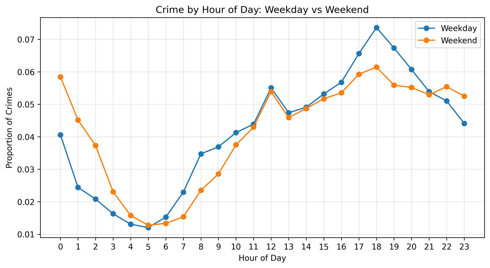
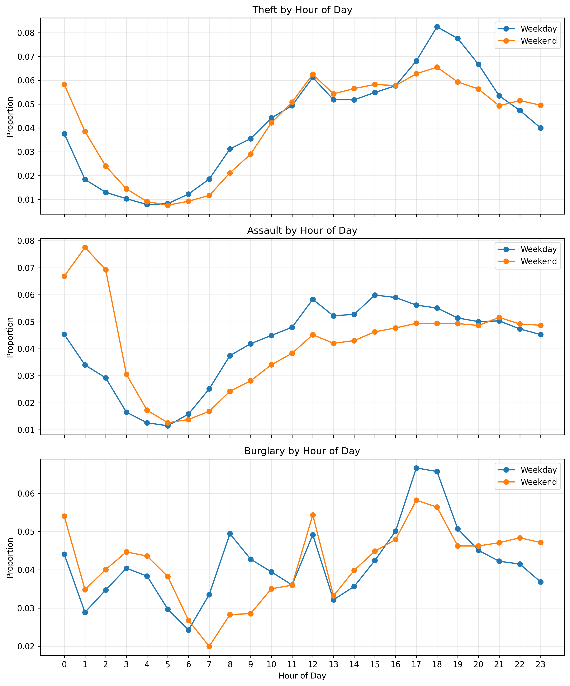
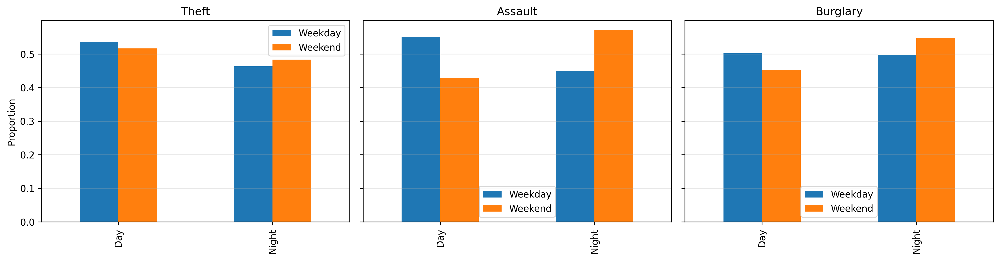

# 02806 Social Data Analysis: Assignment 2

**Authors:** Chrysiida Drakopoulou, Nicola Davalli, Sammy Chauhan
**Topic:** SF Crime Analysis: Do Crimes Change on Weekends?

## Table of Contents
- [Introduction](#introduction)
- [Does crime increase on weekends?](#does-crime-increase-on-weekends)
- [Do different types of crime behave differently?](#do-different-types-of-crime-behave-differently)
- [Key insight: nighttime crime](#key-insight-nighttime-crime)
- [How We Did The Analysis](#how-we-did-the-analysis)
- [Conclusion](#conclusion)

## Introduction

It is often assumed that crime increases on weekneds due to nightlife and increased social activity. In this analysis, we investigate whether crime actually becomes more frequent on weekneds and if not, whether its patterns change in more subtle ways.

---

## Does crime increase on weekends?

  

<em>Figure 1: Overall hourly crime distribution for weekdays and weekends.</em>

The overall number of crimes remains very similar between weekdays and weekends. While there are small differences throughout the day, there is no clear increase in total crime during weekends.

---

## Do different types of crime behave differently?

  

<em>Figure 2: Hourly distributions for theft, assault, and burglary on weekdays and weekends.</em>

Looking at individual crime types, the general patterns are quite similar. Theft dominates in both weekdays and weekends, peaking in the late afternoon. Burglary and assault also follow comparable daily trends.

However, small differences begin to appear when we look more closely at timing.

---

## When does crime happen?

Although the total number of crimes does not change significantly, their timing does.

Across all crime types, weekend activity is more concentrated during late-night hours, while weekday crime tends to peak earlier in the evening.

---

## Key insight: Nighttime crime

  

<em>Figure 3: Share of crimes occurring at night for selected crime types.</em>

The most striking difference appears for assault. During weekdays, around 45% of assaults occur at night, while on weekends this increases to approximately 57%.

Burglary and theft also show slight increases at night on weekends, but the effect is much smaller. This suggests that violent crime is more influenced by weekend behavior than property crime.

  

<em>Figure 4: Day-versus-night comparison by crime type.</em>

These results suggest that the key weekend effect is not more crime overall, but a shift in when crime happens, especially for violent crime.

---

## Visual Exploration

In order to further understand the differences between weekdays and weekends, we analyzed the distribution of crimes by time of day for different types of crimes.

The hourly charts reveal that, while the overall patterns are similar, significant differences appear at specific times. Theft exhibits a steady daily cycle, peaking in the late afternoon on both weekdays and weekends. In contrast, assault shows a notable shift, with higher rates during late-night hours on weekends. Burglary shows more moderate variation, with slightly increased nighttime activity on weekends.

These illustrations highlight that the key difference is not the total number of crimes, but when they occur.

---

## How We Did The Analysis

We used a dataset on reported crimes and first converted the timestamps into structured temporal features, such as the time of day and the day of the week. Based on the day of the week, each observation was classified as either a weekday or a weekend day.

We then selected a subset of crime types (theft, assault, and burglary) and calculated normalized hourly distributions. This means that for each category, we calculated the percentage of crimes occurring every hour, allowing for a fair comparison between weekdays and weekends, regardless of the total number.

Finally, we grouped the data into day and night periods to highlight broader temporal patterns and calculated the percentage of crimes occurring at night for each crime type.

## Code

---

## Conclusion

Crime does not increase on weekends, but it shifts in timing.

Violent crimes, especially assault, become more concentrated during nighttime hours, while property crimes such as theft remain relatively stable. This highlights how human activity patterns influence when crime occurs rather than how much crime occurs.

---

## Interactive Plots (optional)

[View weekday interactive plot](images/weekday_hourly_crime_distribution_by_type.html)  
[View weekend interactive plot](images/weekend_hourly_crime_distribution_by_type.html)

## Next Steps

- Please let us know if we should focus elsewhere or try a different visualization.
- Want to change the main topic? We’re open!
