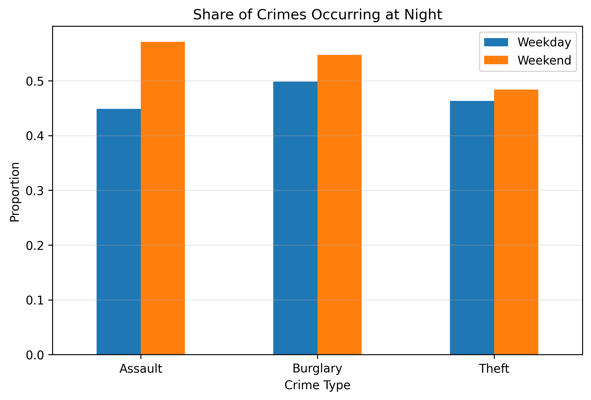

# 02806 Social Data Analysis: Assignment 2

**Authors:** Chrysiida Drakopoulou, Nicola Davalli, Sammy Chauhan
**Topic:** SF Crime Analysis: Do Crimes Change on Weekends?

## Table of Contents
- [Introduction](#introduction)
- [Does crime increase on weekends?](#does-crime-increase-on-weekends)
- [Do different types of crime behave differently?](#do-different-types-of-crime-behave-differently)
- [Key insight: nighttime crime](#key-insight-nighttime-crime)
- [How We Did The Analysis](#how-we-did-the-analysis)
- [Conclusion](#conclusion)

## Introduction

It is often assumed that crime increases on weekends due to nightlife and increased social activity. In this analysis, we investigate whether crime in San Fransisco (SF) actually becomes more frequent on weekends and if not, whether its patterns change in more subtle ways.

Using SF crime data, we will compare weekdays and weekends across three crome types, assaults, burglary, and theft.
Our story is aimed to a general audience and focuses on a key insight: weekend effects are mostly temporal, not overall colume changes. 

---

## Nighttime share by crime type

  

<em>Figure 1: Share of incidents occurring at night for assault, burglary, and theft on weekdays vs weekends. Assault shows the clearest weekend night shift, while burglary and theft change less</em>

The overall number of crimes remains very similar between weekdays and weekends. While there are small differences throughout the day, there is no clear increase in total crime during weekends.

---

## Spatial context of SF crime patterns
## Map missing remember to upload it

  <a href="plots/sf_crime_map.html" target="_blank">Open interactive SF crime map</a>

<em>Figure 2. Interactive map of crime incidents in San Francisco. The map adds geographic context and shows where incidents are concentrated across the city.</em>

The map complements the timing analysis by showing where incidents cluster. 
Even if total weekday/weekend volume is similar, location patterns and neighborhood concentration still matter for intepretation.

---

## Hourly weekend profile by crime type

  <a href="plots/weekend_hourly_crime_distribution_by_type.html" target="_blank">Open interactive weekend hourly chart</a>

<em>Figure 3. Interactive hourly distribution for assault, burglary, and theft during weekends. Use the legend to toggle crime types and compare their peak hours.</em>

This interactive chart helps the reader inspect how each crime type behaves over the 24-hour cycle.  
It supports the main narrative that weekend dynamics are driven by timing differences, especially for violent crime.

## Conclusion 

Crime does not appear to increase dramatically on weekends in total volume.  
Instead, the main weekend effect is a **shift in timing**, with a stronger concentration of incidents during nighttime hours—most clearly for assault.

This distinction is important: if we only look at totals, we miss meaningful behavioral patterns in when crimes occur.

---

## Limitations and critical interpretation

- Crime data reflects reported/incorporated incidents, not all incidents that occur.
- Observed differences may reflect reporting practices or enforcement intensity, not only true behavioral change.
- This analysis is descriptive and does not establish causality.

---

## References

- San Francisco Police Department incident dataset (course workflow source).
- Richardson, R., Schultz, J., & Crawford, K. (2019). *Dirty Data, Bad Predictions: How Civil Rights Violations Impact Police Data, Predictive Policing Systems, and Justice*.
- Additional context sources can be added here (news, policy reports, neighborhood background).

---

## Contributions

All group members contributed approximately equally to the assignment.

- **Chrysiida Drakopoulou:** Data preparation, narrative drafting, and interpretation review.  
- **Nicola Davalli:** Visualization development, figure export/embedding, and layout refinement.  
- **Sammy Chauhan:** Analysis design, interactive plot integration, and final editing/quality checks.
  
